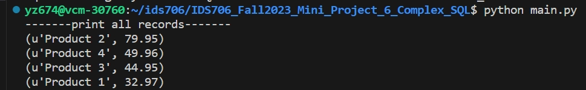

[](https://github.com/yuchenz427/IDS706-Python-Template/actions/workflows/install.yml)
[](https://github.com/yuchenz427/IDS706-Python-Template/actions/workflows/lint.yml)
[](https://github.com/yuchenz427/IDS706-Python-Template/actions/workflows/format.yml)
[](https://github.com/yuchenz427/IDS706-Python-Template/actions/workflows/format.yml)
# IDS706_Fall2023_Mini_Project_6_Complex_SQL

IDS706 week 6 mini project: Design a complex SQL query involving joins, aggregation, and sorting.

It contains:

- ``.devcontainer`` includes a `Dockerfile` that specifies the configurations of container, and a `devcontainer.json` which is a configuration file used in the context of Visual Studio Code

- ``workflows`` includes `GitHub Actions`, enables automated build, test and deployment for the project

- ``Makefile`` specifies build automation on Linux

- ``requirements.txt`` lists the dependencies, libraries, and specific versions of Python packages required for the project

It also includes ``main.py`` and ``test_main.py`` as sample files to show the functionality of the CI pipeline.

## Interact with SQLite database

First, create some Tables:

**Customers**: <br>
| customer_id | customer_name | country |

**Orders**: <br>
| order_id | order_date | customer_id |

**Order_Items**: <br>
| order_item_id | order_id | product_id | quantity | unit_price | order_id | product_id |

**Products**: <br>
| product_id | product_name | category_id | price |

**Categories**: <br>
| category_id |

After inserting data to each of the table, execute the following query:
```
SELECT 
                p.product_name,
                SUM(oi.quantity * oi.unit_price) AS total_sales
                FROM products p
                JOIN order_items oi ON p.product_id = oi.product_id
                GROUP BY p.product_name
                ORDER BY total_sales DESC;
```
The query joins **Products** and **Order_Items** table. It first calculates the total sale price of each order item, then groups the result by product name, finally sorts the result by total sales price. The result should be the names of the products, following by their total sales prices, and sorted by the sales prices from high to low, as shown below: 
